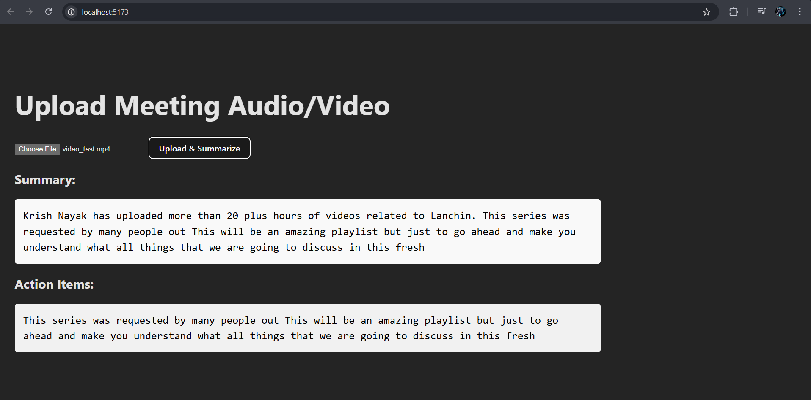

#  Meeting Summarizer App

A smart web app that takes in meeting audio/video recordings and outputs a concise summary and action items using OpenAI Whisper and BRAT for summary.

---

## 📸 Screenshot

---

##  Project Structure
meeting-summarizer/  
├── backend/ # Flask backend (transcription & summary)  
├── Frontend/meeting-summarizer/ # React frontend (user interface)  
├── .gitignore  
├── README.md  

---

##  Tech Stack

| Layer       | Technology          |
|-------------|---------------------|
| Frontend    | React + Vite        |
| Backend     | Python + Flask      |
| AI Model    | OpenAI Whisper + BRAT |
| Database    | SQLite (local)      |

---

##  Features

- Upload meeting recordings (audio/video)
- Automatically generate a summary
- Extract actionable items
- Simple UI built with React

---

##  Setup Instructions

###  Prerequisites

- Node.js & npm
- Python 3.9+
- `pip` package manager

---

### Backend Setup (Flask)

cd backend
python -m venv venv
# On Windows:
.\venv\Scripts\activate
# On Mac/Linux:
source venv/bin/activate

pip install -r requirement.txt
python app.py

### Fronted Setup
cd Frontend/meeting-summarizer
npm install
npm run dev

